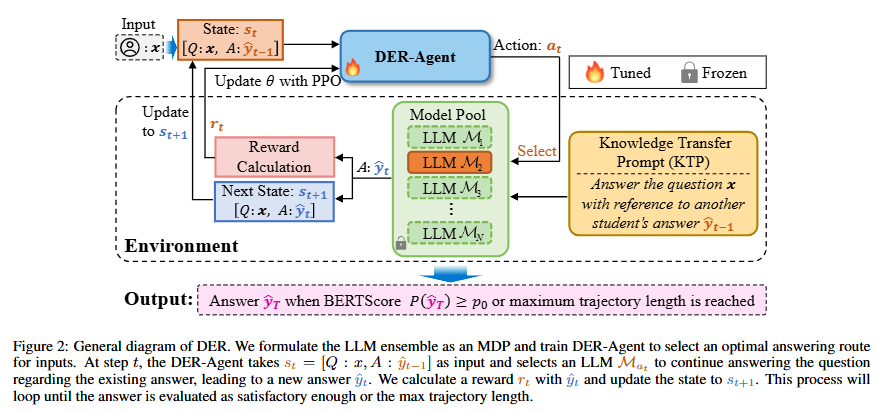

<h1 align="center">
     <br>Efficient Dynamic Ensembling for Multiple LLM Experts
<p align="center">
    <a href="https://www.ijcai.org/proceedings/2025/0900.pdf">
        
    </a>
</p>

<h4 align="center"></a>
     
>[Jinwu Hu](https://scholar.google.com/citations?user=XmqjPi0AAAAJ&hl=en), Yufeng Wang, [Shuhai Zhang](https://scholar.google.com/citations?user=oNhLYoEAAAAJ&hl=en), [Kai Zhou](https://scholar.google.com/citations?hl=en&user=58UyQ9cAAAAJ), [Guohao Chen](https://scholar.google.com/citations?user=HZbzdNEAAAAJ&hl=en&oi=ao), [Yu Hu](https://scholar.google.com/citations?user=OJxJ2kQAAAAJ&hl=en), [Bin Xiao](https://faculty.cqupt.edu.cn/xiaobin/zh_CN/index.htm), [Mingkui Tan](https://tanmingkui.github.io/)\
<sub>South China University of Technology, Pazhou Laboratory, Peng Cheng Laboratory, Hong Kong Polytechnic University, Chongqing University of Posts and Telecommunications</sub>

<p align="center">
  
</p>

---

## ✨ Abstract
LLMs have demonstrated impressive performance across various language tasks. However, the strengths of LLMs can vary due to different architectures, model sizes, areas of training data, etc. Therefore, ensemble reasoning for the strengths of different LLM experts is critical to achieving consistent and satisfactory performance on diverse inputs across a wide range of tasks. However, existing LLM ensemble methods are either computationally intensive or incapable of leveraging complementary knowledge among LLM experts for various inputs. In this paper, we propose an efficient Dynamic Ensemble Reasoning paradigm, called **DER** to integrate the strengths of multiple LLM experts conditioned on dynamic inputs. Specifically, we model the LLM ensemble reasoning problem as a Markov Decision Process, wherein an agent sequentially takes inputs to request knowledge from an LLM candidate and passes the output to a subsequent LLM candidate. Moreover, we devise a reward function to train a DER-Agent to dynamically select an optimal answering route given the input questions, aiming to achieve the highest performance with as few computational resources as possible.  Last, to fully transfer the expert knowledge from the prior LLMs, we develop a Knowledge Transfer Prompt that enables the subsequent LLM candidates to transfer complementary knowledge effectively. Experiments demonstrate that our method uses fewer computational resources to achieve better performance compared to state-of-the-art baselines. 

---


## 🔥News
- *2025-04-30*: DER is accepted by IJCAI2025.
- *2024-12-10*: We have released our paper on Arxiv.

## 🚀Quick Start 
```bash
## clone our repo
git clone https://github.com/Fhujinwu/DER.git
cd DER
## install DER environment
conda create --name DER --yes python=3.11
conda activate DER
pip install r requirements.txt
```

## 🔨 Training
```bash
python train_ppo_multi.py
```

## ⚖️ Evaluation
```bash
python test_ppo_multi.py
```


## 🙏 Acknowledgements
Thanks for the open-source code of [Tianshou](https://github.com/thu-ml/tianshou).

## 💬 Citation

If you find our work useful, please consider citing:

```text
@inproceedings{hu2025efficient,
  title={Efficient dynamic ensembling for multiple LLM experts},
  author={Hu, Jinwu and Wang, Yufeng and Zhang, Shuhai and Zhou, Kai and Chen, Guohao and Hu, Yu and Xiao, Bin and Tan, Mingkui},
  booktitle={Proceedings of the Thirty-Fourth International Joint Conference on Artificial Intelligence},
  pages={8095--8103},
  year={2025}
}
```

## 🌟 Star History


